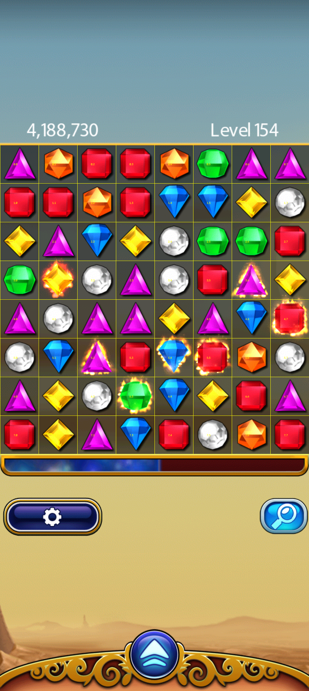
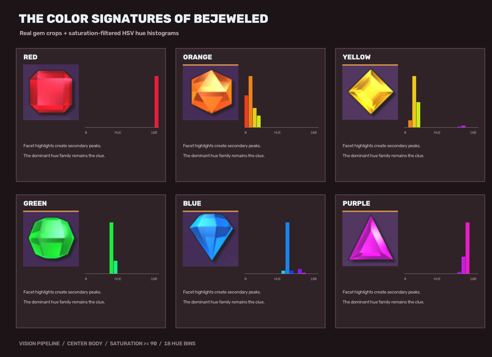

# BejeweledPlayer


PC-side Python implementation of the **Wireless-ADB Strategic Match-3 Autoplayer** (SRS v1.0).

<p align="center">
  
</p>

## How it Works

The autoplayer uses ADB to fetch lossless screenshots, applies computer vision to isolate the game board, identifies the gems, mathematically scores every possible adjacent swap using a strategic valuation function, and sends touch events back to the device to execute the optimal move.

<p align="center">
  
</p>

### Detection Algorithm

The autoplayer uses a highly deterministic, heuristic computer vision pipeline (bypassing the need for heavy neural networks):
1. **Grid Isolation:** Crops the lossless ADB screenshot to the exact board coordinates defined in the configuration and slices it into an 8x8 grid.
2. **Hue Correlation:** Extracts the center pixels of each cell, filters for high color saturation, and generates an HSV hue histogram. The gem's color is then identified by matching this histogram against predefined correlation templates (Red, Green, Blue, Yellow, Purple, Orange, White).
3. **Special Gems:** Multicolored *Hypercubes* are identified by checking for secondary hue family thresholds inside the gem body. *Flame* gems preserve their underlying base color but are flagged by detecting intense brightness values along their exterior boundaries.

### Key Features
- **Deterministic Play:** Evaluates every adjacent swap. Prioritizes 5/4 matches, then ranks 3-matches by immediate points, hypercube blast risk mitigation, setup potential, and board mobility.
- **Wireless ADB:** Completely untethered operation.
- **Safety First:** Polls for board settlement after every swipe (detecting cascading animations and menus). Execution safely aborts on unexpected screens, game overs, or unrecognised states.
- **Color Histograms:** Custom robust hue-template correlation matching. Special gems (hypercubes, flame gems) are natively recognised.

## Development Setup

Requirements: Python 3.12 or newer. On Debian/Ubuntu, install venv support first if necessary:

```bash
sudo apt install python3.12-venv
python3.12 -m venv .venv
source .venv/bin/activate
pip install -e '.[dev]'
```

Run the Phase 0 checks:

```bash
pytest
ruff check .
mypy
autoplayer validate-config --config config/target_720x1536.toml
```

## CLI Usage

List connected ADB devices:
```bash
autoplayer devices
```

**(Optional)** Render an overlay debug image against an existing screenshot without ADB:
```bash
autoplayer render-debug \
  --config config/target_720x1536.toml \
  --frame board.png \
  --output board.overlay.png
```

### Observation Mode
Capture one lossless frame and render the calibrated grid to see what the bot sees:
```bash
autoplayer observe --config config/pixel9pro_960x2142.toml
```

### Playing the Game

> **Note:** The active ADB device serial must be configured in your selected `.toml` file (e.g., `device.serial = "192.168.1.100:5555"`).

**Minimal Turn**  
Capture the foreground board, authorize one selected move, wait for the outcome, and exit:
```bash
autoplayer turn --config config/pixel9pro_960x2142.toml --execute
```

**Bounded Play**  
Run a bounded, recorded sequence using the capture/validation gate before every move (stops automatically after the limit):
```bash
autoplayer multi-turn \
  --config config/pixel9pro_960x2142.toml \
  --turns 25 \
  --execute
```

**Unbounded Play**  
Run indefinitely until manually stopped (`Ctrl+C`) or safely aborted by an unrecognised board state (like an ad or game over screen):
```bash
autoplayer play \
  --config config/pixel9pro_960x2142.toml \
  --execute
```

Each turn re-captures the board. It polls after the swipe with a 50 ms minimum wait and 80 ms cadence until a valid settled board is observed (with a default 25 second timeout). Every completed turn appends to an incrementally updated `summary.json` file inside the `sessions/` directory.

## Baseline Status & Documentation

- **Full SRS:** See the complete Software Requirements Specification in [`docs/Bejeweled_ADB_Autoplayer_SRS.md`](docs/Bejeweled_ADB_Autoplayer_SRS.md).
- **Vision Data:** Labeled boards used for recognition tests and calibration are located in [`datasets/vision-20/`](datasets/vision-20/) and [`datasets/vision-llm-labeled/`](datasets/vision-llm-labeled/).
- Initial target profiles: `720x1536` portrait and `960x2142` portrait (Pixel 9 Pro).
- See [`docs/TRACEABILITY.md`](docs/TRACEABILITY.md) and [`docs/UNRESOLVED_RULES.md`](docs/UNRESOLVED_RULES.md) before implementing later phases.
- Hardware-free development: `FakeFrameSource` and `FakeActionSink` are available.
